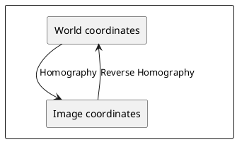
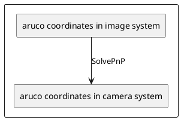

# How arcuo markers pose estimation works

There is two way to estimate the pose of an Aruco marker:
- Homography
- SolvePnP

## Homography

Since we know the position of the corners of the 4 fixed markers in the playground coordinate system and in the image coordinate system, we can find a function that allow us to transform the coordinates from a world to an other. 



The homography method is based on the fact that the corners of the marker are coplanar. The homography matrix is a 3x3 matrix that relates the coordinates of the corners of the marker in the image to the coordinates of the corners of the marker in the world. The homography matrix can be computed using the OpenCV function `cv2.findHomography()`. Once the homography matrix is computed, the pose of the marker can be estimated using the OpenCV function `cv2.decomposeHomographyMat()`.


## SolvePnP
The solvePnP method is based on the fact that we know the 3D coordinates of the corners of the marker in the world and the 2D coordinates of the corners of the marker in the image. The solvePnP method uses the OpenCV function `cv2.solvePnP()` to estimate the pose of the marker. The solvePnP method is more accurate than the homography method, but it is also more computationally expensive. The solvePnP method is also more robust to noise and occlusions than the homography method.

Based on the computer vision context, solvePnP returns coordinates in the **camera's reference frame**, not the **playground frame**.



The function solves the Perspective-n-Point problem to find the pose of the marker relative to the camera:
- Translation vector (tvec): 3D position of the marker origin in camera coordinates (X, Y, Z where Z is depth)
- Rotation vector (rvec): Orientation of the marker relative to the camera

Coordinate Frame Details
Camera frame (what solvePnP gives you):

Origin: Camera optical center
Z-axis: Points forward along camera's view direction
X-axis: Points right (from camera's perspective)
Y-axis: Points down (OpenCV convention)

To get terrain/field coordinates, you must:

1. Calibrate camera pose: Determine the transformation between camera frame and field frame (typically using fixed reference markers like IDs 20-23 in Eurobot rules)
2. Apply transformation:
```
# Pseudo-code
field_position = camera_to_field_transform @ marker_in_camera_frame
```